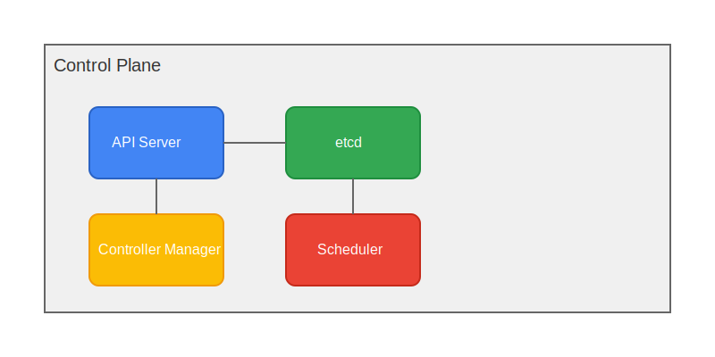

# Kubernetes Control Plane Components

The Control Plane (Master Node) is responsible for container orchestration and maintaining the desired state of the cluster.

## Components Overview

### 1. kube-apiserver

The API server is the front-end for the Kubernetes control plane. All external communication is handled by this component.

**Responsibilities:**
- Exposes the Kubernetes API
- Handles all administrative tasks
- Validates and processes API requests
- Serves as the frontend to the cluster's shared state

### 2. etcd

A consistent and highly-available key-value store used as Kubernetes' backing store for all cluster data.

**Responsibilities:**
- Stores cluster state and configuration
- Provides reliable data storage
- Handles concurrent operations
- Maintains consistency across cluster

### 3. kube-scheduler

Watches for newly created pods with no assigned node and selects a node for them to run on.

**Responsibilities:**
- Pod scheduling
- Resource evaluation
- Constraint checking
- Priority management

### 4. kube-controller-manager

Runs controller processes that regulate the state of the cluster.

**Responsibilities:**
- Node controller: Monitoring and responding to node failures
- Replication controller: Maintaining the correct number of pods
- Endpoints controller: Populates the Endpoints object
- Service Account & Token controllers: Create default accounts and API access tokens

## Architecture Diagram

## Communication Flow

1. All communications go through the API server
2. etcd stores the state
3. Controller manager ensures desired state
4. Scheduler assigns work to nodes