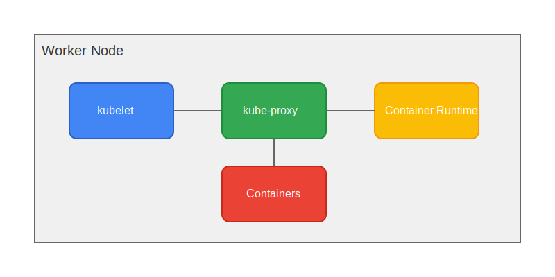

# Kubernetes Worker Node Components

Worker nodes are the machines that run your applications and cloud workloads.

## Components Overview

### 1. kubelet

The primary node agent that runs on each node. It ensures containers are running in a Pod.

**Responsibilities:**
- Pod management
- Container health checks
- Resource reporting
- Node status updates

### 2. kube-proxy

Network proxy that runs on each node, implementing part of the Kubernetes Service concept.

**Responsibilities:**
- Network rules maintenance
- Connection forwarding
- Load balancing
- Service abstraction

### 3. Container Runtime

Software responsible for running containers (Docker, containerd, CRI-O, etc.).

**Responsibilities:**
- Container execution
- Image management
- Container lifecycle
- Resource isolation

## Architecture Diagram

## Component Interaction

1. kubelet receives Pod specifications
2. Container runtime pulls and runs containers
3. kube-proxy manages networking
4. All components report to control plane