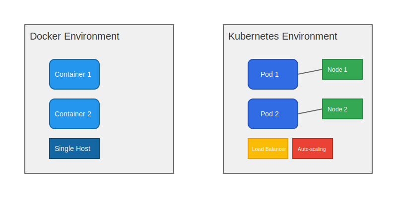

# Kubernetes vs Docker

A detailed comparison between Kubernetes and Docker, understanding their roles, capabilities, and use cases.

## Key Differences

### 1. Scope
- **Docker**
  - Container runtime and building tool
  - Focuses on containerization
  - Single-host container management
  
- **Kubernetes**
  - Container orchestration platform
  - Focuses on container orchestration
  - Multi-host container management

### 2. Scale
- **Docker**
  - Manages containers on a single node
  - Limited scaling capabilities
  - Manual container management
  
- **Kubernetes**
  - Manages containers across multiple nodes
  - Automatic scaling
  - Cluster-wide management

## Visual Comparison

## When to Use What

### Use Docker When:
- Developing applications locally
- Simple container deployments
- Single-host environments
- Learning container basics
- Quick prototyping

### Use Kubernetes When:
- Running applications at scale
- Need high availability
- Complex microservices architecture
- Multi-host deployments
- Advanced orchestration needs