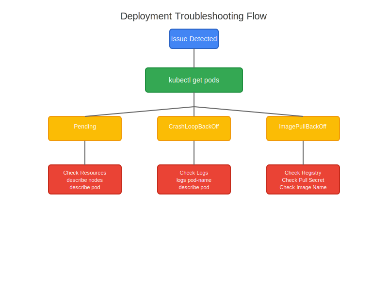

# Deployment Troubleshooting Guide

## Troubleshooting Flow



Follow the flow diagram above to diagnose and resolve common deployment issues.

## Common Issues and Solutions

### 1. Pods Stuck in Pending State

#### Symptoms
```bash
$ kubectl get pods
NAME                        READY   STATUS    RESTARTS   AGE
my-app-7b6f8d4589-x2jd9    0/1     Pending   0          5m
```

#### Diagnosis Steps
```bash
# Check pod details
kubectl describe pod my-app-7b6f8d4589-x2jd9

# Check node resources
kubectl describe nodes
```

#### Common Causes and Solutions
1. **Insufficient Resources**
   - Symptom: `Insufficient cpu`, `Insufficient memory`
   - Solution: Adjust resource requests/limits or add nodes
   ```yaml
   resources:
     requests:
       memory: "64Mi"
       cpu: "250m"
     limits:
       memory: "128Mi"
       cpu: "500m"
   ```

2. **Node Selector Issues**
   - Symptom: `0/3 nodes are available: 3 node(s) didn't match node selector`
   - Solution: Check node labels or update selector
   ```bash
   kubectl label nodes <node-name> environment=prod
   ```

### 2. Pods Crashing or Restarting

#### Symptoms
```bash
$ kubectl get pods
NAME                        READY   STATUS    RESTARTS   AGE
my-app-7b6f8d4589-x2jd9    0/1     CrashLoopBackOff   3          5m
```

#### Quick Reference Guide

1. Pod Status Issues:
   ```bash
   # Get pod status
   kubectl get pods
   
   # Describe pod for events
   kubectl describe pod <pod-name>
   
   # Check logs
   kubectl logs <pod-name>
   kubectl logs <pod-name> --previous   # If container has restarted
   ```

2. Container Issues:
   ```bash
   # Check container details
   kubectl describe pod <pod-name> | grep -A10 "Containers:"
   
   # Execute commands in container
   kubectl exec -it <pod-name> -- /bin/sh
   
   # Check environment variables
   kubectl exec <pod-name> -- printenv
   ```

3. Resource Issues:
   ```bash
   # Check node resources
   kubectl describe nodes | grep -A5 "Allocated resources"
   
   # Top pods by resource usage
   kubectl top pods
   ```

### Emergency Response Actions

1. **Quick Pod Deletion/Recreation**
   ```bash
   kubectl delete pod <pod-name>
   # Deployment will automatically create new pod
   ```

2. **Scaling for Temporary Relief**
   ```bash
   # Scale up replicas
   kubectl scale deployment <deployment-name> --replicas=5
   
   # Scale down if needed
   kubectl scale deployment <deployment-name> --replicas=3
   ```

3. **Emergency Rollback**
   ```bash
   # Check rollout history
   kubectl rollout history deployment/<deployment-name>
   
   # Rollback to previous version
   kubectl rollout undo deployment/<deployment-name>
   ```

### Prevention Tips

1. **Resource Management**
   ```yaml
   resources:
     requests:
       cpu: "100m"
       memory: "128Mi"
     limits:
       cpu: "200m"
       memory: "256Mi"
   ```

2. **Health Checks**
   ```yaml
   livenessProbe:
     httpGet:
       path: /healthz
       port: 8080
     initialDelaySeconds: 15
     periodSeconds: 10
   readinessProbe:
     httpGet:
       path: /ready
       port: 8080
     initialDelaySeconds: 5
     periodSeconds: 5
   ```

3. **Proper Logging**
   ```yaml
   # Add labels for better log filtering
   metadata:
     labels:
       app: my-app
       environment: production
       version: "1.0.0"
   ```

4. **Backup Strategy**
   ```bash
   # Backup deployment config
   kubectl get deployment <deployment-name> -o yaml > deployment-backup.yaml
   
   # Backup secrets and configmaps
   kubectl get secret <secret-name> -o yaml > secret-backup.yaml
   kubectl get configmap <configmap-name> -o yaml > configmap-backup.yaml
   ```

## Common Command Reference

```bash
# Deployment Status
kubectl rollout status deployment/<deployment-name>

# Deployment History
kubectl rollout history deployment/<deployment-name>

# Pod Logs
kubectl logs -f <pod-name>

# Events
kubectl get events --sort-by=.metadata.creationTimestamp

# Resource Usage
kubectl top pods
kubectl top nodes
```

Remember to always check the logs and events first, as they often provide the most direct insight into issues.