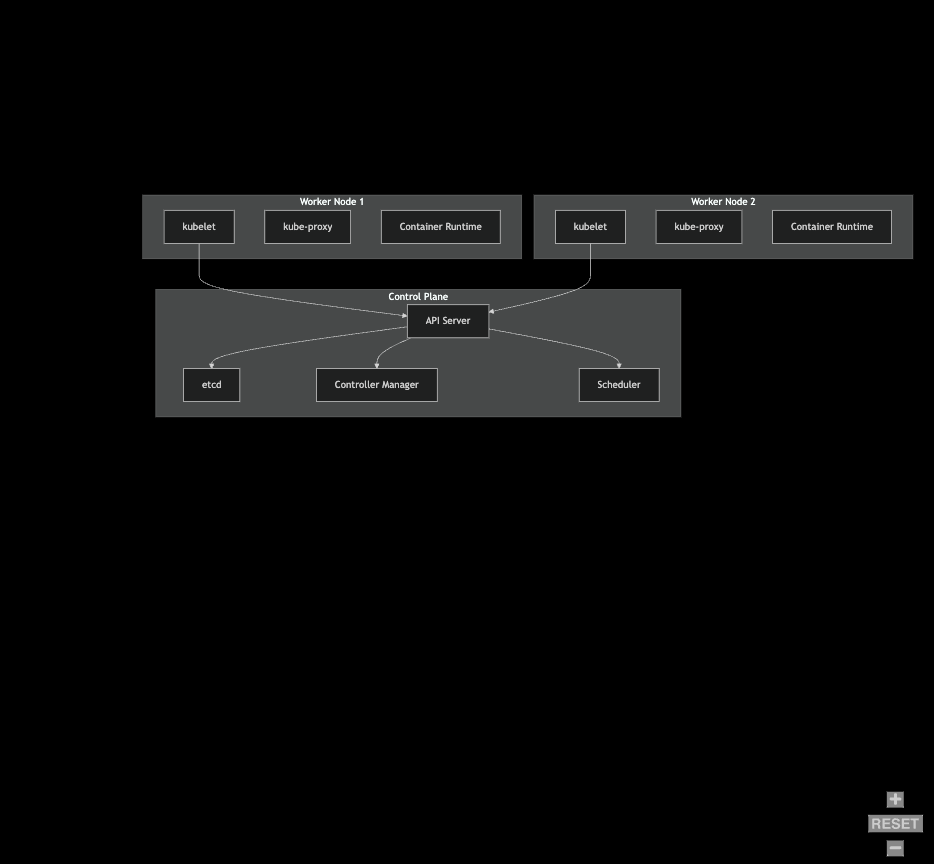
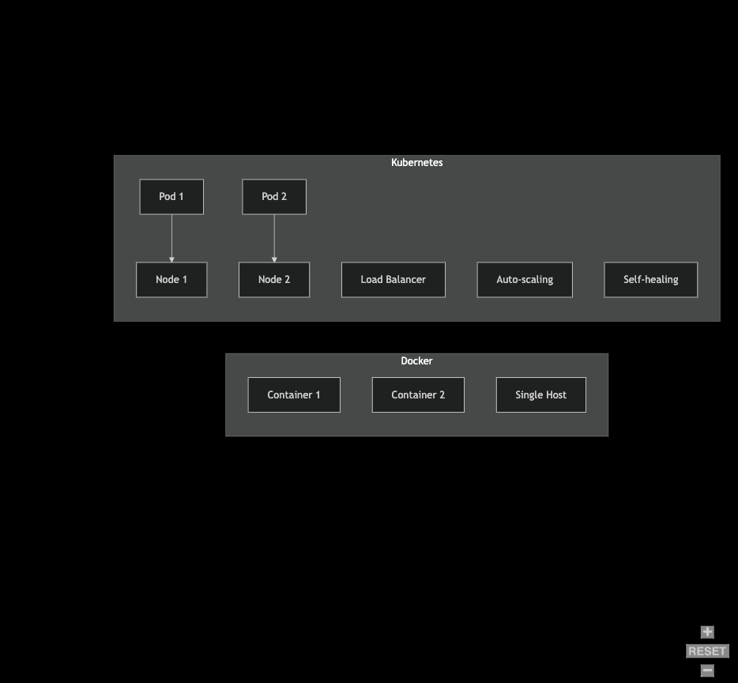

# Kubernetes Fundamentals Study Guide

## What is Kubernetes (K8s)?

Kubernetes is an open-source container orchestration platform designed to automate the deployment, scaling, and management of containerized applications. Originally developed by Google, it is now maintained by the Cloud Native Computing Foundation (CNCF).

### Key Features

1. **Container Orchestration**: Automates the deployment and scaling of containerized applications
2. **Self-healing**: Automatically restarts failed containers and replaces/reschedules containers when nodes die
3. **Horizontal Scaling**: Can scale applications up or down based on demand
4. **Load Balancing**: Distributes network traffic to ensure stable deployment
5. **Automated Rollouts/Rollbacks**: Changes to application or config can be rolled out gradually
6. **Secret Management**: Manages sensitive information like passwords and SSH keys
7. **Storage Orchestration**: Automatically mounts storage systems of your choice

### Control Plane Components (Master Node)

1. **kube-apiserver**
   - Front-end for Kubernetes control plane
   - Exposes the Kubernetes API
   - Handles all administrative tasks and communication

2. **etcd**
   - Consistent and highly-available key-value store
   - Stores all cluster data
   - Source of truth for cluster state

3. **kube-scheduler**
   - Watches for newly created pods with no assigned node
   - Selects node for pod to run on based on resource requirements

4. **kube-controller-manager**
   - Runs controller processes
   - Handles node failures, pod replication, endpoint creation
   - Manages service account & API access tokens

### Worker Node Components

1. **kubelet**
   - Ensures containers are running in a pod
   - Reports node and pod status to master
   - Handles container operations

2. **kube-proxy**
   - Network proxy on each node
   - Maintains network rules for pod communication
   - Handles internal network communication

3. **Container Runtime**
   - Software responsible for running containers
   - Usually Docker, but can be containerd, CRI-O, etc.

## Kubernetes Architecture

## Kubernetes vs Docker

### Key Differences

1. **Scope**
   - Docker: Primarily container runtime and building tool
   - Kubernetes: Complete container orchestration platform

2. **Scale**
   - Docker: Manages containers on a single node
   - Kubernetes: Manages containers across multiple nodes (cluster)

3. **High Availability**
   - Docker: Limited built-in HA capabilities
   - Kubernetes: Built-in HA, load balancing, and scaling

4. **Deployment**
   - Docker: Simple deployment using docker-compose
   - Kubernetes: Complex but powerful deployment with yaml manifests

### Feature Comparison Table

| Feature | Docker | Kubernetes |
|---------|--------|------------|
| Container Runtime | Yes | No (requires external runtime) |
| Multi-host Networking | Limited | Advanced |
| Auto-scaling | No | Yes |
| Rolling Updates | Basic | Advanced |
| Self-healing | No | Yes |
| Load Balancing | Basic | Advanced |
| Storage Management | Basic | Advanced |
| Multi-node Clustering | No (Swarm separate) | Yes |

### Container Orchestration Visualization

## Best Practices

1. Always use version control for Kubernetes manifests
2. Implement resource limits for containers
3. Use namespaces to organize resources
4. Implement health checks for applications
5. Use ConfigMaps and Secrets for configuration
6. Regular backup of etcd data
7. Implement proper monitoring and logging
